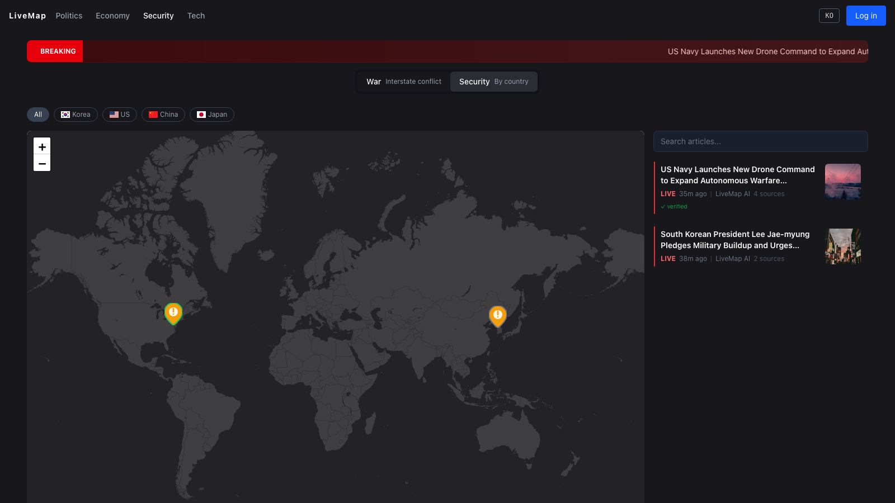
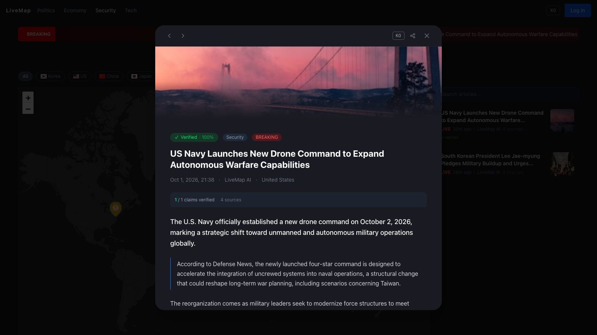
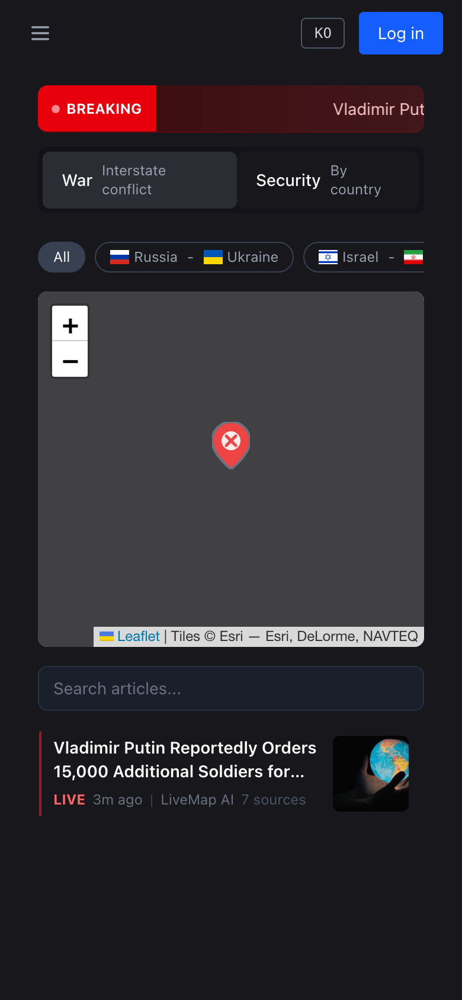
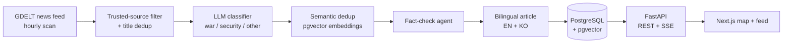

# LiveMap

**AI-verified war & security news, mapped in real time.**

LiveMap watches global news feeds, fact-checks breaking events claim-by-claim with LLMs, and publishes bilingual (English / Korean) articles pinned to an interactive map.

**Live demo:** https://livemap-news.vercel.app
Sign in with the prefilled account `abc@gmail.com` / `password1234`, or create your own.



| Article with claim-level verification            | Mobile                                                                   |
| ------------------------------------------------ | ------------------------------------------------------------------------ |
|  |  |

## Features

- **Interactive conflict map** — articles pinned by location, filtered by theater (Russia–Ukraine, Israel–Iran) or country (Korea, US, China, Japan)
- **Claim-level fact-checking** — every article shows how many extracted claims were supported, plus the sources used as evidence
- **Bilingual articles** — each story is generated in English and Korean; toggle the article language from the header or the article view
- **Live updates** — new articles are pushed to open browsers over Server-Sent Events, with a breaking-news ticker
- **Full-text search** across English and Korean article text (PostgreSQL `tsvector`)
- **Authentication** — email/password sign-up and sign-in with NextAuth (JWT sessions); Google/Discord OAuth appear when keys are configured
- Responsive layout for desktop and mobile

## How it works



The fact-check agent runs five stages for each event:

1. **Claim extraction** — split the event into atomic, checkable claims
2. **Deduplication** — hash + embedding similarity against recent events, so the same story from different outlets is published once
3. **Evidence retrieval** — DuckDuckGo, GDELT and Tavily searches, filtered by source tier and publication date
4. **QA-based verification** — an LLM judges each claim against the evidence (supported / refuted / not enough info)
5. **Verdict aggregation** — events need supported claims from at least two sources before an article is written

## Tech stack

| Layer    | Technology                                                                                           |
| -------- | ---------------------------------------------------------------------------------------------------- |
| Frontend | Next.js 16 (App Router), React 19, Tailwind CSS v4, shadcn/ui, Leaflet, Jotai, TanStack Query        |
| Auth     | NextAuth v5 (JWT sessions), Prisma 7                                                                 |
| Backend  | FastAPI, SQLAlchemy (async) + asyncpg, Alembic, LangChain                                            |
| Database | PostgreSQL 16 + pgvector                                                                             |
| AI       | Groq (`gpt-oss-20b`, `qwen3.8-27b`), Google Gemini (`gemini-3.5-flash-lite`, `gemini-embedding-001`) |

## Deployment

The whole stack runs on free tiers:

| Part     | Service                                                                      |
| -------- | ---------------------------------------------------------------------------- |
| Frontend | Vercel — deploys the `dev` branch                                            |
| Backend  | Render (Docker web service, 512 MB) — [`render.yaml`](render.yaml) blueprint |
| Database | Neon PostgreSQL with pgvector                                                |
| LLMs     | Groq and Gemini free tiers                                                   |

Notes on fitting into free tiers:

- **Embeddings without a GPU host** — the local `bge-m3` model needs ~2 GB of RAM, so on small hosts embeddings come from the Gemini API at the same 1024 dimensions. Gemini embeddings have a higher similarity baseline, so the dedup thresholds switch automatically to values calibrated for it (same event 0.90–0.97, related 0.75–0.82, unrelated 0.63–0.73).
- **Token budget** — evidence is capped per verification call and claims are verified sequentially, keeping one investigation around 2–5K tokens under Groq's 8K tokens/minute limit.
- **Migrations on boot** — the container runs `alembic upgrade head` before starting, since Render's free plan has no pre-deploy step.

## Running locally

Requirements: Docker, [uv](https://docs.astral.sh/uv/), Node.js 22, pnpm.

```bash
# Database
cd backend && docker compose up -d db

# Backend (http://localhost:8010, API docs at /docs)
cd backend
cp .env.example .env          # add GROQ / GEMINI / TAVILY keys
uv sync                       # add `--group ml` to use the local bge-m3 model
uv run alembic upgrade head
uv run uvicorn app.main:app --reload --port 8010

# Frontend (http://localhost:3010)
cd client
cp .env.example .env.local    # set NEXT_PUBLIC_API_BASE_URL=http://localhost:8010/api/v1
pnpm install
pnpm dev --port 3010
```

Tests: `cd backend && uv run pytest`, `cd client && pnpm build`.

## Repository layout

```
backend/                FastAPI service
  app/agent/            scanner, fact-check agent, article generator, embeddings
  app/api/v1/routes/    feeds (REST + SSE) and agent endpoints
  alembic/              database migrations
client/                 Next.js app
  app/security/         map + feed page
  app/auth/             sign-in / sign-up
render.yaml             Render blueprint for the backend
```

The `dev` branch is the English version that is deployed; `main` keeps the original Korean UI.
